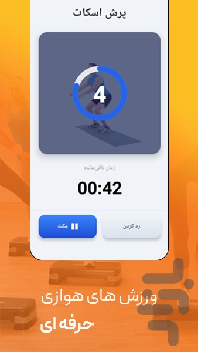

## تپش

<p align="justify">
تپش یک اپلیکیشن موبایل است که با استفاده از React Native و Expo توسعه داده شده است.
این برنامه برای انجام ورزش‌های هوازی طراحی شده و تلاش کرده‌ام تجربه‌ای روان و کاربردی برای کاربران فراهم کنم. تپش با ارائه‌ی تمرینات متنوع، تایمر هوشمند و گزارش‌های پیشرفت، به افراد کمک می‌کند مسیر تناسب اندام خود را راحت‌تر دنبال کنند.
در حال حاضر اپلیکیشن در مرحله توسعه قرار دارد و به‌زودی در بازار منتشر خواهد شد. هدف من این است که با ترکیب سادگی در طراحی و امکانات تخصصی ورزشی، اپلیکیشنی بسازم که به کاربران در رسیدن به اهداف سلامتی‌شان کمک کند.

## Tapesh

<p align="justify">
Tapesh is a mobile application developed using React Native and Expo.
The app is designed for aerobic workouts and aims to provide users with a smooth and practical experience. With a variety of exercises, a smart timer, and progress tracking reports, Tapesh helps individuals stay on track with their fitness journey.

<p align="justify">
Currently, the app is in development and will soon be released on the market. My goal is to combine simplicity in design with professional fitness features to create an app that truly supports users in achieving their health and wellness goals.

### گالری تصاویر

<p align="center">
  
  
  
</p>

<p align="center">
  
  
  
</p>
<p align="center">
  
  
  
</p>

---

## Project Structure

The project follows a modular and organized structure to ensure scalability and easy maintenance:

## ساختار پروژه

پروژه از یک ساختار مدولار و منظم پیروی می‌کند تا مقیاس‌پذیری و نگهداری آن آسان باشد:

```
TAPESH/
├── _layout.tsx
├── app/
│   ├── (tabs)/
│   │   ├── _layout.tsx
│   │   ├── index.tsx
│   │   ├── profile.tsx
│   │   └── reports.tsx
├── onboarding/
│   ├── _layout.tsx
│   │   ├── body-info.tsx
│   │   ├── final-loading.tsx
│   │   ├── gender.tsx
│   │   ├── goal.tsx
│   │   ├── index.tsx
│   │   ├── _layout.tsx
│   │   ├── Exercise.tsx
│   │   ├── index.tsx
│   │   ├── Rest.tsx
│   │   ├── Summary.tsx
│   │   ├── Workout.tsx
│   │   └── WorkoutDetail.tsx
├── assets/
├── node_modules/
├── src/
│   ├── components/
│   │   ├── ExerciseCard.tsx
│   │   ├── GetReadyCountdown.tsx
│   │   ├── SettingsButton.tsx
│   │   ├── SettingsModal.tsx
│   │   ├── Splash.tsx
│   │   └── Timer.tsx
│   ├── hooks/
│   │   ├── useMusicPlayer.ts
│   │   └── useTimer.ts
│   ├── locales/
│   │   ├── en.json
│   │   ├── fa.json
│   │   └── i18n.ts
│   ├── services/
│   │   └── assetMap.ts
│   ├── store/
│   │   ├── index.ts
│   │   ├── musicSlice.ts
│   │   ├── programSlice.ts
│   │   ├── storage.ts
│   │   ├── userSlice.ts
│   │   └── workoutSlice.ts
│   └── types/
│       └── index.ts
```

## Technologies

- **Expo**: Built with Expo, using its powerful Expo Router for navigation.  
- **TypeScript**: Used throughout the project for static typing and greater code reliability.  
- **Redux with Redux Persist**: State management is handled with Redux, with slices for different domains. Redux Persist is integrated to maintain state across app restarts.  
- **Multilingual with i18n**: Multi-language support is provided via locale files (e.g., `en.json`, `fa.json`).  
- **Custom Hooks**: Hooks like `useMusicPlayer` and `useTimer` are designed for reusability and enhanced functionality.  


## فناوری‌ها


- **اکسپو**: برنامه با Expo ساخته شده و از سیستم مسیریابی قدرتمند آن (Expo Router) برای ناوبری استفاده می‌کند.
- **تایپ اسکریپت**: در سراسر پروژه برای تایپ استاتیک و قابلیت اطمینان بیشتر کد استفاده شده است.
- **ریداکس با Redux Persist**: مدیریت وضعیت با Redux انجام می‌شود، با اسلایس‌هایی برای حوزه‌های مختلف. Redux Persist برای حفظ وضعیت در زمان راه‌اندازی مجدد برنامه ادغام شده است.
- **چندزبانی با i18n**: پشتیبانی از چندزبانه با فایل‌های محلی (مانند `en.json` و `fa.json`) ارائه می‌شود.
- **هوک‌های سفارشی**: هوک‌هایی مانند `useMusicPlayer` و `useTimer` برای افزایش قابلیت استفاده مجدد و عملکرد طراحی شده‌اند.


